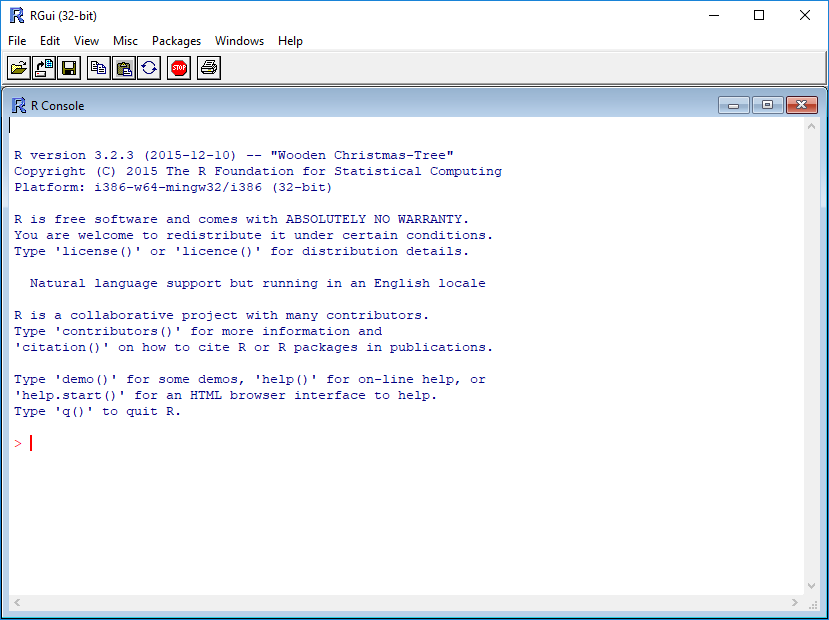

```{r, include = FALSE}
knitr::opts_chunk$set(fig.width=6, fig.height=3.5, fig.align="center")
```

## Learning Objectives

-   Understand the value of learning R
-   Navigate RStudio
-   Define terms: object, function, argument, package, vector, data
    frame.
-   Use help documentation in RStudio.

## Why learn R?

-   **R is free, open-source, and cross-platform.** Anyone can inspect
    the source code to see how R works. Because of this transparency,
    there is less chance for mistakes, and if you (or someone else) find
    some, you can report and fix bugs. Because R is open source and is
    supported by a large community of developers and users, there is a
    very large selection of third-party add-on packages which are freely
    available to extend R's native capabilities.

-   **R code is great for reproducibility**. Reproducibility is when
    someone else (including your future self) can obtain the same
    results from the same dataset when using the same analysis. R
    integrates with other tools to generate manuscripts from your code.
    If you collect more data, or fix a mistake in your dataset, the
    figures and the statistical tests in your manuscript are updated
    automatically.

-   **R relies on a series of written commands, not on remembering a
    succession of pointing and clicking.** If you want to redo your
    analysis because you collected more data, you don't have to remember
    which button you clicked in which order to obtain your results; you
    just have to run your script again.

-   **R is interdisciplinary and extensible** With 10,000+ packages that
    can be installed to extend its capabilities, R provides a framework
    that allows you to combine statistical approaches from many
    scientific disciplines to best suit the analytical framework you
    need to analyze your data. For instance, R has packages for image
    analysis, GIS, time series, population genetics, and a lot more.

-   **R works on data of all shapes and sizes.** The skills you learn
    with R scale easily with the size of your dataset. Whether your
    dataset has hundreds or millions of lines, it won't make much
    difference to you. R is designed for data analysis. It comes with
    special data structures and data types that make handling of missing
    data and statistical factors convenient. R can connect to
    spreadsheets, databases, and many other data formats, on your
    computer or on the web.

-   **R produces high-quality graphics.** The plotting functionalities
    in R are endless, and allow you to adjust any aspect of your graph
    to convey most effectively the message from your data.

-   **R has a large and welcoming community.** Thousands of people use R
    daily. Many of them are willing to help you through mailing lists
    and websites such as [Stack Overflow](https://stackoverflow.com/),
    or on the [RStudio community](https://community.rstudio.com/).
    Questions which are backed up with [short, reproducible code
    snippets](https://www.tidyverse.org/help/) are more likely to
    attract knowledgeable responses.

## Starting out in R

[R](https://cran.rstudio.com/) is both a programming language and an
interactive environment for data exploration and statistics.

Working with R is primarily text-based. The basic mode of use for R is
that the user provides commands in the R language and then R computes
and displays the result.

### Downloading, Installing and Running R

**Download**\
R can be downloaded from [CRAN (The Comprehensive R Archive
Network)](https://cran.rstudio.com/index.html) for Windows, Linux, or
Mac.

**Install**\
Installation of R is like most software packages and you will be guided.
Should you have any issues or need help you can refer to [R Installation
and
Administration](https://cran.r-project.org/doc/manuals/r-release/R-admin.html)

**Running**\
R can be launched from your software or applications launcher or When
working at a command line on UNIX or Windows, the command `R` can be
used for starting the main R program in the form `R`

You will see a console similar to this appear:

```{r echo=F}

```

While it is possible to work solely through the console or using a
command line interface, the ideal environment to work in R is RStudio.

### RStudio

We will be working in
[RStudio](https://www.rstudio.com/products/rstudio/download/). 

The main way of working with R is the *console*, where you enter
commands and view results. RStudio surrounds this with various
conveniences.

RStudio is divided into four "panes". The placement of these panes and
their content can be customized (see menu, Tools -\> Global Options -\>
Pane Layout).

The Default Layout is:

-   Top Left - **Source**: your scripts and documents
-   Bottom Left - **Console**: what R would look and be like without
    RStudio
-   Top Right - **Environment/History**: look here to see what you have
    done
-   Bottom Right - **Files** and more: see the contents of the
    project/working directory here, like your Script.R file

```{r echo=F}
knitr::include_graphics("fig/rstudio_session_4pane_layout.png")
```

### RStudio Cloud

RStudio Cloud is a browser-based version of RStudio. It will allow you
to use RStudio without needing to download anything to your computer.
You can also easily share your R projects with others. While we
recommend downloading RStudio for regular use, there may be times you find it helpful to have a cloud based solution.