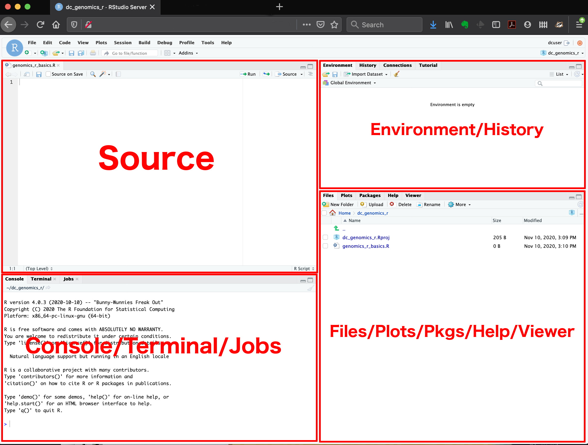
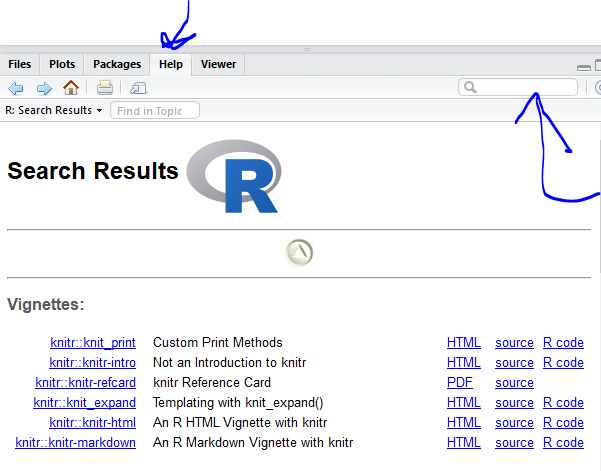

```{r, include = FALSE}
knitr::opts_chunk$set(fig.width=6, fig.height=3.5, fig.align="center")
```

## Learning Objectives

-   Understand the value of learning R
-   Navigate RStudio
-   Define terms: object, function, argument, package, vector, data
    frame.
-   Use help documentation in RStudio.

## Why learn R?

-   **R is free, open-source, and cross-platform.** Anyone can inspect
    the source code to see how R works. Because of this transparency,
    there is less chance for mistakes, and if you (or someone else) find
    some, you can report and fix bugs. Because R is open source and is
    supported by a large community of developers and users, there is a
    very large selection of third-party add-on packages which are freely
    available to extend R's native capabilities.

-   **R code is great for reproducibility**. Reproducibility is when
    someone else (including your future self) can obtain the same
    results from the same dataset when using the same analysis. R
    integrates with other tools to generate manuscripts from your code.
    If you collect more data, or fix a mistake in your dataset, the
    figures and the statistical tests in your manuscript are updated
    automatically.

-   **R relies on a series of written commands, not on remembering a
    succession of pointing and clicking.** If you want to redo your
    analysis because you collected more data, you don't have to remember
    which button you clicked in which order to obtain your results; you
    just have to run your script again.

-   **R is interdisciplinary and extensible** With 10,000+ packages that
    can be installed to extend its capabilities, R provides a framework
    that allows you to combine statistical approaches from many
    scientific disciplines to best suit the analytical framework you
    need to analyze your data. For instance, R has packages for image
    analysis, GIS, time series, population genetics, and a lot more.

-   **R works on data of all shapes and sizes.** The skills you learn
    with R scale easily with the size of your dataset. Whether your
    dataset has hundreds or millions of lines, it won't make much
    difference to you. R is designed for data analysis. It comes with
    special data structures and data types that make handling of missing
    data and statistical factors convenient. R can connect to
    spreadsheets, databases, and many other data formats, on your
    computer or on the web.

-   **R produces high-quality graphics.** The plotting functionalities
    in R are endless, and allow you to adjust any aspect of your graph
    to convey most effectively the message from your data.

-   **R has a large and welcoming community.** Thousands of people use R
    daily. Many of them are willing to help you through mailing lists
    and websites such as [Stack Overflow](https://stackoverflow.com/),
    or on the [RStudio community](https://community.rstudio.com/).
    Questions which are backed up with [short, reproducible code
    snippets](https://www.tidyverse.org/help/) are more likely to
    attract knowledgeable responses.

## Starting out in R

[R](https://cran.rstudio.com/) is both a programming language and an
interactive environment for data exploration and statistics.

Working with R is primarily text-based. The basic mode of use for R is
that the user provides commands in the R language and then R computes
and displays the result.

### Downloading, Installing and Running R

**Download**\
R can be downloaded from [CRAN (The Comprehensive R Archive
Network)](https://cran.rstudio.com/index.html) for Windows, Linux, or
Mac.

**Install**\
Installation of R is like most software packages and you will be guided.
Should you have any issues or need help you can refer to [R Installation
and
Administration](https://cran.r-project.org/doc/manuals/r-release/R-admin.html)

**Running**\
R can be launched from your software or applications launcher or When
working at a command line on UNIX or Windows, the command `R` can be
used for starting the main R program in the form `R`

You will see a console similar to this appear:

```{r echo=F}
knitr::include_graphics("fig/console.png")
```

While it is possible to work solely through the console or using a
command line interface, the ideal environment to work in R is RStudio.

### RStudio

We will be working in
[RStudio](https://www.rstudio.com/products/rstudio/download/). 

The main way of working with R is the *console*, where you enter
commands and view results. RStudio surrounds this with various
conveniences.

RStudio is divided into four "panes". The placement of these panes and
their content can be customized (see menu, Tools -\> Global Options -\>
Pane Layout).

The Default Layout is:

-   Top Left - **Source**: your scripts and documents
-   Bottom Left - **Console**: what R would look and be like without
    RStudio
-   Top Right - **Environment/History**: look here to see what you have
    done
-   Bottom Right - **Files** and more: see the contents of the
    project/working directory here, like your Script.R file

```{r echo=F}

```

### RStudio Cloud

RStudio Cloud is a browser-based version of RStudio. It will allow you
to use RStudio without needing to download anything to your computer.
You can also easily share your R projects with others. While we
recommend downloading RStudio for regular use, there may be times you find it helpful to have a cloud based solution.


## Working in the Console

The console is an interactive environment for RStudio, click on the
"Console" pane, type `3 + 3` and press enter. R displays the result of
the calculation.

```{r }
3 + 3
```

`+` is called an operator. R has the operators you would expect for for
basic mathematics:

**Arithmetic operators**<br>

| operator | meaning    |
|:---------|:-----------|
| \+       | plus       |
| \-       | minus      |
| \*       | times      |
| /        | divided by |
| \^       | exponent   |

**Logical Operators**<br>

| operator | meaning                  |
|:---------|:-------------------------|
| ==       | exactly equal            |
| !=       | not equal to             |
| \<       | less than                |
| \<=      | less than or equal to    |
| \>       | greater than             |
| \>=      | greater than or equal to |
| x\|y     | x or y                   |
| x&y      | x and y                  |
| !x       | not x                    |

Spaces can be used to make code easier to read, but are not required.

```{r}
2 * 2 == 4
```

## Objects

### Creating Objects

When you have certain values, data, plots, etc that you want to work
with You can create objects (make assignments) in R with the assignment
operator `<-`:

All R statements where you create objects, assignment statements, have
the same form:

    object_name <- value

When reading that code say "object name gets value" in your head.

```{r}
x <- 3 * 4

x
```

Once you have an object you can do other calculations with it.

```{r}
x * x
```

::: {.callout-note}
**Objects vs. Variables**<br> What are known as objects in R are known
as variables in many other programming languages. Depending on the
context, object and variable can have drastically different meanings.
However, in this lesson, the two words are used synonymously. For more
information see:
<https://cran.r-project.org/doc/manuals/r-release/R-lang.html#Objects>
:::

We can store all kinds of information as objects. For example:

```{r}
human_chr_number <- 23
gene_name <- 'pten'
human_diploid_chr_num <-  2 * human_chr_number
```


Once an object has a value, you can change that value by overwriting it.
R will not give you a warning or error if you overwriting an object,
which may or may not be a good thing depending on how you look at it.

```{r, purl=FALSE}
# gene_name has the value 'pten'
# We will now assign the new value 'tp53'
gene_name <- 'tp53'
```

You can see the value assigned to an object in the RStudio environment pane, or you can run a line of code that has only an object name, and R will normally
display the contents of that object in the console

You can also remove an object from R's memory entirely with the `rm()` function.

```{r}
# delete the object 'gene_name'
rm(gene_name)
```

Now, if we try to print that object we are told the
object no longer exists.


You will make lots of assignments and `<-` is a pain to type. Avoid the
temptation to use `=`: it will work, but it will cause confusion later.
Instead, use RStudio's keyboard shortcut: <kbd>`Alt + -`</kbd> (the
minus sign).

Notice that RStudio automagically surrounds `<-` with spaces, which is a
good code formatting practice. Code is miserable to read on a good day,
so giveyoureyesabreak and use spaces.

::: {.callout-important}
## Naming Objects

The name for objects must start with a letter, and can only contain
letters, numbers, underscores (`_`)and periods (`.`). The name of the
object should describe what is being assigned so they typically will be
multiple words. One convention used is **snake_case** where lowercase
words are separated with `_`. Another popular style is **camelCase**
where compound words or phrases are written so that each word or
abbreviation in the middle of the phrase begins with a capital letter,
with no intervening spaces or punctuation and the first letter is
lowercase.

    thisIsCamelCase
    some_use_snake_case
    others.use.periods                  #avoid
    Others_pRefer.to_RENOUNCEconvention #avoid
:::


## Functions and their arguments

Functions are "canned scripts" that automate more complicated sets of
commands including operations assignments, etc. Many functions are
predefined, or can be made available by importing R *packages* (more on
that later). A function usually gets one or more inputs called
*arguments*. Functions often (but not always) return a *value*.

A typical example would be the function `round()`. The input (the
argument) must be a number, and the return value (in fact, the output)
is that number rounded to the nearest whole number. Executing a function
('running it') is called *calling* the function. You can save the output
of a function to an object. The format would look like:

```{r, eval=FALSE, purl=FALSE}
b <- round(a)
```

Here, the value of `a` is given to the `round()` function, the `round()`
function rounds the number, and returns the value which is then assigned
to the object `b`.

The return 'value' of a function need not be numerical (like that of
`sqrt()`), and it also does not need to be a single item: it can be a
set of things, or even a dataset. We'll see that when we read data files
into R.

Arguments can be anything, not only numbers or filenames, but also other
objects. Exactly what each argument means differs per function, and must
be looked up in the documentation (see below). Some functions take
arguments which may either be specified by the user, or, if left out,
take on a *default* value: these are called *options*. Options are
typically used to alter the way the function operates, such as whether
it ignores 'bad values', or what symbol to use in a plot. However, if
you want something specific, you can specify a value of your choice
which will be used instead of the default.

`round()` only needs one argument, a number, or object that is storing a
numerical value.

```{r, results='show', purl=FALSE}
round(3.14159)
```
or 

```{r, results='show', purl=FALSE}

pi <- 3.14159

round(pi)
```

Here, we've called `round()` on . That's because the default action of the function is to round to the
nearest whole number. If we want more digits we can see how to do that
by getting information about the `round` function. We can use
`args(round)` or look at the help for this function using `?round`.

```{r, results='show', purl=FALSE}
args(round)
```

We see that if we want a different number of digits, we can type
`digits=2` or however many we want.

```{r, results='show', purl=FALSE}
round(pi, digits = 2)
```

If you provide the arguments in the exact same order as they are defined
you don't have to name them:

```{r, results='show', purl=FALSE}
round(pi, 2)
```

And if you do name the arguments, you can switch their order:

```{r, results='show', purl=FALSE}
round(digits = 2, x = pi)
```

It's good practice to put the non-optional arguments (like the number
you're rounding) first in your function call, and to specify the names
of all optional arguments. If you don't, someone reading your code might
have to look up the definition of a function with unfamiliar arguments
to understand what you're doing.

### Getting Help

In the previous example we looked up the arguments to `round()` using `args(round)` alternatively we could've looked at the help page for `round()` to find this out with `?round`. 
To get help about a particular package or function you can access the help pane in RStudio and type its name in the search box.

```{r echo=F,out.width="80%"}

```

The `help()` function and `?` help operator in R provide access to the
documentation pages for R functions, data sets, and other objects, both
for packages in the standard R distribution and for contributed
packages. To do so type as follows

    help({function})
    help(package = {package name})

    ?{function}
    ?"{package name}"

::: {.callout-tip}

## Exercise

Look at the documentation for the `seq` function. What does `seq` do?
Give an example of using `seq` with either the `by` or `length.out`
argument.
:::

## Packages

While you can write your own functions, most functions you use will be
part of a package. In R, the fundamental unit of shareable code is the
package. A package bundles together code, data, documentation, and
tests, and is easy to share with others. As of July 2018, there were
over 14,000 packages available on the Comprehensive R Archive Network,
or CRAN, the public clearing house for R packages. This huge variety of
packages is one of the reasons that R is so successful.

Installing a package using RStudio requires selecting the Install
Packages Button in the Files, Plots, Packages Pane

```{r echo=F, out.width="75%"}
knitr::include_graphics("fig/installPackages.png")
```

In the pop up box that results simply type the name of the package and
check "install dependencies" and click Install

```{r echo=F,out.width="100%"}
knitr::include_graphics("fig/packagesDialog.png")
```

Its also possible for you to install and load packages from the console.
Always make sure to put the package name in quotes when installing and
setting `dependencies = True`

```{r eval=FALSE}
install.packages("tidyverse", dependencies = TRUE)    
library(tidyverse)

```

You only need to install a package once, but you need to reload it every
time you start a new session.

## Vectors

A *vector* is a collection of values. "Vector" means different things in
different fields (mathematics, geometry, biology), but in R it is a
fancy name for a collection of values. We call the individual values
*elements* of the vector. It is one of the most common data structures
you will work with in R.
## Vectors

Vectors are probably the most used commonly used object type in R. **A
vector is a collection of values that are all of the same type (numbers,
characters, etc.)**. One of the most common ways to create a vector is
to use the `c()` function - the "concatenate" or "combine" function.
Inside the function you may enter one or more values; for multiple
values, separate each value with a comma:

```{r, purl=FALSE}
# Create the SNP gene name vector

snp_genes <- c("OXTR", "ACTN3", "AR", "OPRM1")
```

Vectors always have a **mode** and a **length**. You can check these
with the `mode()` and `length()` functions respectively. Another useful
function that gives both of these pieces of information is the `str()`
(structure) function.

```{r, purl=FALSE}
# Check the mode, length, and structure of 'snp_genes'
mode(snp_genes)
length(snp_genes)
str(snp_genes)
```

Vectors are quite important in R. Another data type that we will work
with later in this lesson, data frames, are collections of vectors. What
we learn here about vectors will pay off even more when we start working
with data frames.

## Creating and subsetting vectors

Let's create a few more vectors to play around with:

```{r, purl=FALSE}
# Some interesting human SNPs
# while accuracy is important, typos in the data won't hurt you here

snps <- c("rs53576", "rs1815739", "rs6152", "rs1799971")
snp_chromosomes <- c("3", "11", "X", "6")
snp_positions <- c(8762685, 66560624, 67545785, 154039662)
```

Once we have vectors, one thing we may want to do is specifically
retrieve one or more values from our vector. To do so, we use **bracket
notation**. We type the name of the vector followed by square brackets.
In those square brackets we place the index (e.g. a number) in that
bracket as follows:

```{r, purl=FALSE}
# get the 3rd value in the snp vector
snps[3]
```

In R, every item your vector is indexed, starting from the first item
(1) through to the final number of items in your vector. You can also
retrieve a range of numbers:

```{r, purl=FALSE}
# get the 1st through 3rd value in the snp vector

snps[1:3]
```

If you want to retrieve several (but not necessarily sequential) items
from a vector, you pass a **vector of indices**; a vector that has the
numbered positions you wish to retrieve.

```{r, purl=FALSE}
# get the 1st, 3rd, and 4th value in the snp vector

snps[c(1, 3, 4)]
```

There are additional (and perhaps less commonly used) ways of subsetting
a vector (see [these
examples](https://thomasleeper.com/Rcourse/Tutorials/vectorindexing.html)).
Also, several of these subsetting expressions can be combined:

```{r, purl=FALSE}
# get the 1st through the 3rd value, and 4th value in the snp vector
# yes, this is a little silly in a vector of only 4 values.
snps[c(1:3,4)]
```

## Adding to, removing, or replacing values in existing vectors

Once you have an existing vector, you may want to add a new item to it.
To do so, you can use the `c()` function again to add your new value:

```{r, purl=FALSE}
# add the gene "CYP1A1" and "APOA5" to our list of snp genes
# this overwrites our existing vector
snp_genes <- c(snp_genes, "CYP1A1", "APOA5")
```

We can verify that "snp_genes" contains the new gene entry

```{r, purl=FALSE}
snp_genes
```

Using a negative index will return a version of a vector with that
index's value removed:

```{r, purl=FALSE}
snp_genes[-6]
```

We can remove that value from our vector by overwriting it with this
expression:

```{r, purl=FALSE}
snp_genes <- snp_genes[-6]
snp_genes
```

We can also explicitly rename or add a value to our index using double
bracket notation:

```{r, purl=FALSE}
snp_genes[6]<- "APOA5"
snp_genes
```

::: challenge
## Exercise: Examining and subsetting vectors

Answer the following questions to test your knowledge of vectors

Which of the following are true of vectors in R? A) All vectors have a
mode **or** a length\
B) All vectors have a mode **and** a length\
C) Vectors may have different lengths\
D) Items within a vector may be of different modes\
E) You can use the `c()` to add one or more items to an existing vector\
F) You can use the `c()` to add a vector to an existing vector

::: solution
## Solution

A)  False - Vectors have both of these properties\
B)  True\
C)  True\
D)  False - Vectors have only one mode (e.g. numeric, character); all
    items in\
    a vector must be of this mode.
E)  True\
F)  True
:::
:::

## Logical Subsetting

There is one last set of cool subsetting capabilities we want to
introduce. It is possible within R to retrieve items in a vector based
on a logical evaluation or numerical comparison. For example, let's say
we wanted get all of the SNPs in our vector of SNP positions that were
greater than 100,000,000. We could index using the '\>' (greater than)
logical operator:

```{r, purl=FALSE}
snp_positions[snp_positions > 100000000]
```

In the square brackets you place the name of the vector followed by the
comparison operator and (in this case) a numeric value. Some of the most
common logical operators you will use in R are:

| Operator | Description              |
|----------|--------------------------|
| \<       | less than                |
| \<=      | less than or equal to    |
| \>       | greater than             |
| \>=      | greater than or equal to |
| ==       | exactly equal to         |
| !=       | not equal to             |
| !x       | not x                    |
| a        | b                        |
| a & b    | a and b                  |

::: callout
## The magic of programming

The reason why the expression `snp_positions[snp_positions > 100000000]`
works can be better understood if you examine what the expression
"snp_positions \> 100000000" evaluates to:

```{r, purl=FALSE}
snp_positions > 100000000
```

The output above is a logical vector, the 4th element of which is TRUE.
When you pass a logical vector as an index, R will return the true
values:

```{r, purl=FALSE}
snp_positions[c(FALSE, FALSE, FALSE, TRUE)]
```

If you have never coded before, this type of situation starts to expose
the "magic" of programming. We mentioned before that in the bracket
notation you take your named vector followed by brackets which contain
an index: **named_vector\[index\]**. The "magic" is that the index needs
to *evaluate to* a number. So, even if it does not appear to be an
integer (e.g. 1, 2, 3), as long as R can evaluate it, we will get a
result. That our expression `snp_positions[snp_positions > 100000000]`
evaluates to a number can be seen in the following situation. If you
wanted to know which **index** (1, 2, 3, or 4) in our vector of SNP
positions was the one that was greater than 100,000,000?

We can use the `which()` function to return the indices of any item that
evaluates as TRUE in our comparison:

```{r, purl=FALSE}
which(snp_positions > 100000000)
```

**Why this is important**

Often in programming we will not know what inputs and values will be
used when our code is executed. Rather than put in a pre-determined
value (e.g 100000000) we can use an object that can take on whatever
value we need. So for example:

```{r, purl=FALSE}
snp_marker_cutoff <- 100000000
snp_positions[snp_positions > snp_marker_cutoff]
```

Ultimately, it's putting together flexible, reusable code like this that
gets at the "magic" of programming!
:::

## A few final vector tricks

Finally, there are a few other common retrieve or replace operations you
may want to know about. First, you can check to see if any of the values
of your vector are missing (i.e. are `NA`, that stands for
`not avaliable`). Missing data will get a more detailed treatment later,
but the `is.NA()` function will return a logical vector, with TRUE for
any NA value:

```{r, purl=FALSE}
# current value of 'snp_genes':
# chr [1:7] "OXTR" "ACTN3" "AR" "OPRM1" "CYP1A1" NA "APOA5"

is.na(snp_genes)
```

Sometimes, you may wish to find out if a specific value (or several
values) is present a vector. You can do this using the comparison
operator `%in%`, which will return TRUE for any value in your collection
that is in the vector you are searching:

```{r, purl=FALSE}
# current value of 'snp_genes':
# chr [1:7] "OXTR" "ACTN3" "AR" "OPRM1" "CYP1A1" NA "APOA5"

# test to see if "ACTN3" or "APO5A" is in the snp_genes vector
# if you are looking for more than one value, you must pass this as a vector

c("ACTN3","APOA5") %in% snp_genes
```

::: challenge
## Review Exercise 1

What data modes are the following vectors? a. `snps`\
b. `snp_chromosomes`\
c. `snp_positions`

::: solution
## Solution

```{r, purl=FALSE}
mode(snps)
mode(snp_chromosomes)
mode(snp_positions)
```
:::
:::

::: challenge
## Review Exercise 2

Add the following values to the specified vectors: a. To the `snps`
vector add: "rs662799"\
b. To the `snp_chromosomes` vector add: 11\
c. To the `snp_positions` vector add: 116792991

::: solution
## Solution

```{r, purl=FALSE}
snps <- c(snps, "rs662799")
snps
snp_chromosomes <- c(snp_chromosomes, "11") # did you use quotes?
snp_chromosomes
snp_positions <- c(snp_positions, 116792991)
snp_positions
```
:::
:::

::: challenge
## Review Exercise 3

Make the following change to the `snp_genes` vector:

Hint: Your vector should look like this in 'Environment':
`chr [1:7] "OXTR" "ACTN3" "AR" "OPRM1" "CYP1A1" NA "APOA5"`. If not
recreate the vector by running this expression:
`snp_genes <- c("OXTR", "ACTN3", "AR", "OPRM1", "CYP1A1", NA, "APOA5")`

a.  Create a new version of `snp_genes` that does not contain CYP1A1 and
    then\
b.  Add 2 NA values to the end of `snp_genes`

::: solution
## Solution

```{r, purl=FALSE}
snp_genes <- snp_genes[-5]
snp_genes <- c(snp_genes, NA, NA)
snp_genes
```
:::
:::

::: challenge
## Review Exercise 4

Using indexing, create a new vector named `combined` that contains:

-   The the 1st value in `snp_genes`
-   The 1st value in `snps`
-   The 1st value in `snp_chromosomes`
-   The 1st value in `snp_positions`

::: solution
## Solution

```{r, purl=FALSE}
combined <- c(snp_genes[1], snps[1], snp_chromosomes[1], snp_positions[1])
combined
```
:::
:::

::: challenge
## Review Exercise 5

What type of data is `combined`?

::: solution
## Solution

```{r, purl=FALSE}
typeof(combined)
```
:::
:::

::: callout
## Lists

Lists are quite useful in R, but we won't be using them in the genomics
lessons. That said, you may come across lists in the way that some
bioinformatics programs may store and/or return data to you. One of the
key attributes of a list is that, unlike a vector, a list may contain
data of more than one mode. Learn more about creating and using lists
using this [nice tutorial](https://r4ds.had.co.nz/vectors.html#lists).
In this one example, we will create a named list and show you how to
retrieve items from the list.

```{r, purl=FALSE}
# Create a named list using the 'list' function and our SNP examples
# Note, for easy reading we have placed each item in the list on a separate line
# Nothing special about this, you can do this for any multiline commands
# To run this command, make sure the entire command (all 4 lines) are highlighted
# before running
# Note also, as we are doing all this inside the list() function use of the
# '=' sign is good style
snp_data <- list(genes = snp_genes,
                 refference_snp = snps,
                 chromosome = snp_chromosomes,
                 position = snp_positions)
# Examine the structure of the list
str(snp_data)
```

To get all the values for the `position` object in the list, we use the
`$` notation:

```{r, purl=FALSE}
# return all the values of position object

snp_data$position
```

To get the first value in the `position` object, use the `[]` notation
to index:

```{r, purl=FALSE}
# return first value of the position object

snp_data$position[1]
```
:::

::: keypoints
-   Effectively using R is a journey of months or years. Still you don't
    have to be an expert to use R and you can start using and analyzing
    your data with with about a day's worth of training
-   It is important to understand how data are organized by R in a given
    object type and how the mode of that type (e.g. numeric, character,
    logical, etc.) will determine how R will operate on that data.
-   Working with vectors effectively prepares you for understanding how
    data are organized in R.
:::
