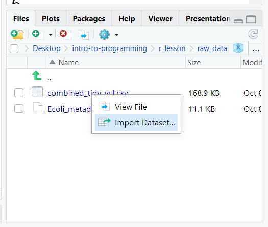
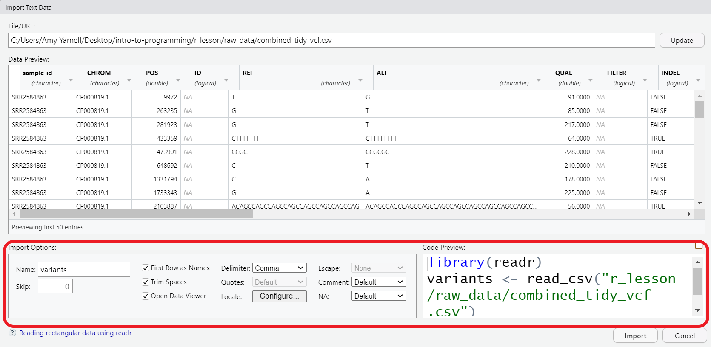
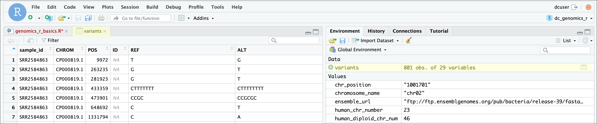
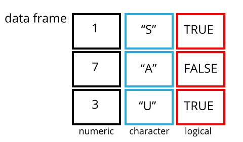

```{r, include = FALSE}
knitr::opts_chunk$set(fig.width=6, fig.height=3.5, fig.align="center")
```

::: {.callout-note appearance="minimal"}

## Objectives

- Explain the basic principle of tidy datasets
- Be able to load a tabular dataset into the R environment.
- Be able to determine the structure of a data frame including its dimensions and the datatypes of variables
- Be able to subset/retrieve values from a data frame
- Be able to import data from Excel

:::

::: {.callout-note appearance="minimal"}
## Questions

- How do I get started with tabular data (e.g. spreadsheets) in R?
- What are some best practices for reading data into R?

:::

## Working with spreadsheets (tabular data)

A substantial amount of the data we work with in genomics will be tabular data,
this is data arranged in rows and columns - also known as spreadsheets. For more on how to work with spreadsheets effectively ([check out this lesson](https://datacarpentry.org/organization-genomics/)). For our
purposes, we want to remind you of a few principles before we work with our
first set of example data:

**1\) Keep raw data separate from analyzed data**

This is principle number one because if you can't tell which files are the
original raw data, you risk making some serious mistakes (e.g. drawing conclusion
from data which have been manipulated in some unknown way).

**2\) Keep spreadsheet data Tidy**

The simplest principle of **Tidy data** is that we have one row in our
spreadsheet for each observation or sample, and one column for every variable
that we measure or report on. 

```{r echo=FALSE}

knitr::include_graphics("fig/tidy-data.png")

```


As simple as this sounds, it's very easily
violated. Most data scientists agree that significant amounts of their time is
spent tidying data for analysis. Read more about data organization in
[this lesson](https://datacarpentry.org/organization-genomics/) and
in [this paper](https://www.jstatsoft.org/article/view/v059i10).

**3\) Trust but verify**

Finally, while you don't need to be paranoid about data, you should have a plan
for how you will prepare it for analysis. **This a focus of this lesson.**
You probably already have a lot of intuition, expectations, assumptions about
your data - the range of values you expect, how many values should have
been recorded, etc. Of course, as the data get larger our human ability to
keep track will start to fail (and yes, it can fail for small data sets too).
R will help you to examine your data so that you can have greater confidence
in your analysis, and its reproducibility.

::: {.callout-tip}

## Tip: Keeping your raw data separate

When you work with data in R, you are not changing the original file you
loaded that data from. This is different than (for example) working with
a spreadsheet program where changing the value of the cell leaves you one
"save"-click away from overwriting the original file. You have to purposely
use a writing function (e.g. `write_csv()`) to save data loaded into R. In
that case, be sure to save the manipulated data into a new file. More on this
later in the lesson.

:::


## Importing tabular data into R

There are several ways to import data into R. Here, we will see how to import data through the RStudio interface, and with code. Either way, we will use a function called `read_csv()`, which is part of the **`tidyverse`** package, **`readr`**.


Now, let's read in the file `combined_tidy_vcf.csv` which will be located in
`r_lesson/raw_data`. In the `Files` pane of RStudio, click on the name of file we want to read in, and select `Import Dataset`. This will open up the import widget.


```{r import, echo=FALSE, alt="screenshot of file editor with csv file selected, and Import Dataset highlighted from dropdown menu."}

  
```

In this widget you can see a preview of the data and make adjustments to data types, separators, header rows, etc. For now, we'll see change the name to `variants`. This will be the object name once the file is imported. By default, the file name will be used as the object name, but it may often be preferable to change this to something shorter, but still descriptive.

Also note that, you can see the code that is generated underlying the widget. We can add that code to a script for better reproducibility of our process. 

```{r import-options, echo=FALSE, alt="screenshot of import widget, options section is highlighted"}


```

Now, you can copy the code from the code preview window, or look in your history pane, select the lines of code that were generated, and send them `To source`, i.e. to our script. 


```{r, eval=FALSE, purl=FALSE}
## read in a CSV file and save it as 'variants'

library(readr)
variants <- read_csv("r_lesson/raw_data/combined_tidy_vcf.csv")
```

Let's take a closer look at what the code is doing. 

1. loading the library **`readr`**. As mentioned earlier, this is part of the **`tidyverse`** family of packages. (R has a built in function similarly named `read.csv()`, they work similarly, but since we will be working with the **`tidyverse`**, we'll choose the **`readr`**.)
1. creating a new object called `variants`
1. assigning to that object the output of the `read_csv()` function.
1. calling the function on our `combined_tidy_vcf.csv` file. That is, the file name is given as the **argument** of our function. Note that the file path must be in quotes. You can also supply URLs as file paths if your data is online.

::: {.callout-tip}
If you press the <kbd>TAB</kbd> key inside the quotes, RStudio will help you autocomplete the file name. Use this to avoid typos!

:::


```{r, echo=FALSE, eval=TRUE, purl=FALSE}
## silently read in CSV file from FigShare

library(readr)
variants <- read_csv("https://ndownloader.figshare.com/files/14632895")
```

One of the first things you should notice now that our data is loaded is that in the Environment window,
you have the `variants` object, listed as 801 obs. (observations/rows)
of 29 variables (columns). Double-clicking on the name of the object will open
a view of the data in a new tab.

```{r view, echo=FALSE}

  
```

::: {.callout-tip}

## What about Excel (and other) files?

You can use the same process described above to import an Excel file, like `Ecoli_metadata.xlsx` in our `raw_data` folder. The main difference is that we use the library **`readxl`** to do the import. The options allow you to do things like select a specific worksheet if your workbook has more than one. It is also possible to import data from other systems like SPSS, STATA, and SAS with the **`haven`** package.

:::

## Working with data frames

A **data frame is the standard way in R to store tabular data**. A data fame
could also be thought of as a collection of vectors, all of which have the same length. While each column is one data type, the data frame over all can have multiple data types. 

```{r data-frames, echo=FALSE}

  

```


Using only two functions, we can learn a lot about out data frame
including some summary statistics as well as well as the "structure" of the data
frame. Let's examine what each of these functions can tell us:

```{r, purl=FALSE}
## get summary statistics on a data frame

summary(variants)
```

Our data frame had 29 variables, so we get 29 fields that summarize the data.
The `QUAL`, `IMF`, and `VDB` variables (and several others) are
numerical data and so you get summary statistics on the min and max values for
these columns, as well as mean, median, and interquartile ranges. Many of the
other variables (e.g. `sample_id`) are treated as characters data (more on this
in a bit).

Now, let's use the `str()` (structure) function to look a little more closely
at how data frames work:

```{r, purl=FALSE, results='hide'}
## get the structure of a data frame

str(variants)
```

You should notice quite a bit of information printing to your console:

- the object type `tibble` is displayed. A tibble is a **`tidyverse`** version of the data frame. It has some properties like printing out nicely to the console, but for our purposes in this class, we will use the terms "data frame" and "tibble" interchangeably.
- After the object type is the dimensions, in this case 801 observations (rows) and 29 variables (columns).
- Each variable (column) has a name (e.g. `sample_id`). This is followed
  by the object mode (e.g. chr, int, etc.). Notice that before each
  variable name there is a `$` - this will be important later.
- Note that we can find this information in the environment pane also.

### Subsetting data frames

Next, we are going to talk about how you can get specific values from data frames.

The first thing to remember is that a data frame is two-dimensional (rows and
columns). Therefore, to select a specific value we will will once again use
`[]` (bracket) notation, but we will specify more than one value (except in some cases
where we are taking a range).

Let's say I wanted the first row and first column

```{r}
variants[1, 1]
```

or I can select the first three rows and first three columns with `:` to get a range.

```{r}
variants[1:3, 1:3]
```

If we want to select all rows and one or more columns, we leave the space before the comma blank.

```{r}
variants[, 1:5]
```

or we can leave out the comma entirely

```{r}
variants[1:5]
```

Alternatively, if we want all columns and just one or more rows, we leave the space after the comma blank

```{r}
variants[1, ]
```

To select non-consecutive columns, use `c()`.
You can always save these results to a new object.

```{r, purl=FALSE}
## put the first three columns of variants into a new data frame called subset

variants_subset <- variants[,c(1:3,6)]
```

::: {.callout-note}

## Subsetting vectors vs data frames

The subsetting notation is very similar to what we learned for
vectors. The key differences include:

- Typically provide two values separated by commas: data.frame[row, column]
- In cases where you are taking a continuous range of numbers use a colon
  between the numbers (start:stop, inclusive)
- For a non continuous set of numbers, pass a vector using `c()`
- Index using the name of a column(s) by passing them as vectors using `c()`

:::

It will generally be easier for us to access columns by name, rather than index. We can do this with the `$` to access a column.

```{r, purl=FALSE}
## extract the "ALT" column to a new object

alt_alleles <- variants_subset$ALT

head(alt_alleles)
```


Like with vectors, we can use brackets with logical operators to subset based on a condition.  We can also use a combination of `$` and `[]` notation. Since we are filtering for just the rows we want, we put the condition before the `,`. 

Let's try some conditional filtering to look for just the rows with the nucleotide 'A' in the `ALT` column.

```{r}
variants_subset[variants_subset$ALT == "A", ]
```
or we can look for all the single-nucleotide alleles (SNPs). 

First let's create an object to store the values of our DNA bases.

```{r, purl=FALSE}
bases <- c("A", "C", "G", "T")

```

Next we can use the  `%in%` operator. This is a logical operator which is similar to `==`, but can be used to filter on multiple values. Here we are saying to check for each of the four bases we captured in the bases object.

```{r}
snps <- variants_subset[variants_subset$ALT %in% bases, ]

head(snps)
```

This leaves us with a data frame (or tibble) of the 707 rows in which the alternative alleles were single nucleotides.

::: {.callout-tip}

## Exercise: Subsetting a data frame

**Try the following indices and functions and try to figure out what they return**

a. `variants[1,1]`

b. `variants[2,4]`

c. `variants[801,29]`

d. `variants[2, ]`

e. `variants[-1, ]`

f. `variants[1:4,1]`

g. `variants[1:10,c("REF","ALT")]`

h. `variants[,c("sample_id")]`

i. `head(variants)`

j. `tail(variants)`

k. `variants$sample_id`

l. `variants[variants$REF == "A",]`

:::: {.callout-warning collapse=true appearance=minimal}

## Solution

a.

```{r}
variants[1,1]
```

b.

```{r}
variants[2,4]
```

c.

```{r}
variants[801,29]
```

d.

```{r}
variants[2, ]
```

e.

```{r, echo=TRUE, eval=FALSE}
variants[-1, ]
```

```{r, echo=FALSE, eval=TRUE}
head(variants[-1, ])
```

f.

```{r}
variants[1:4,1]
```

g.

```{r}
variants[1:10,c("REF","ALT")]
```

h.

```{r, echo=TRUE, eval=FALSE}
variants[,c("sample_id")]
```

```{r, echo=FALSE, eval=TRUE}
head(variants[,c("sample_id")])
```

i.

```{r}
head(variants)
```

j.

```{r}
tail(variants)
```

k.

```{r, echo=TRUE, eval=FALSE}
variants$sample_id
```

```{r, echo=FALSE, eval=TRUE}
head(variants$sample_id)
```

l.

```{r, echo=TRUE, eval=FALSE}
variants[variants$REF == "A",]
```

```{r, echo=FALSE, eval=TRUE}
head(variants[variants$REF == "A",])
```

::::

:::

### Summarizing data frames

In addition to `summary()`, there are other useful base R functions for summarizing your data, or columns in your data.

Use `unique()` to find the unique values in a column. For instance, we could double check that our operation on the `ALT` column worked.

```{r}
unique(snps$ALT)
```
`table()` will give you unique values, plus a count of how often they appear.

```{r}
table(snps$ALT)
```

::: {.callout-note appearance=minimal}

## Key points

- It is easy to import data into R from tabular formats including Excel. However, you still need to check that R has imported and interpreted your data correctly
- There are best practices for organizing your data (keeping it tidy) and R is great for this
- Base R has many useful functions for manipulating your data, but all of R's capabilities are greatly enhanced by software packages developed by the community

:::


